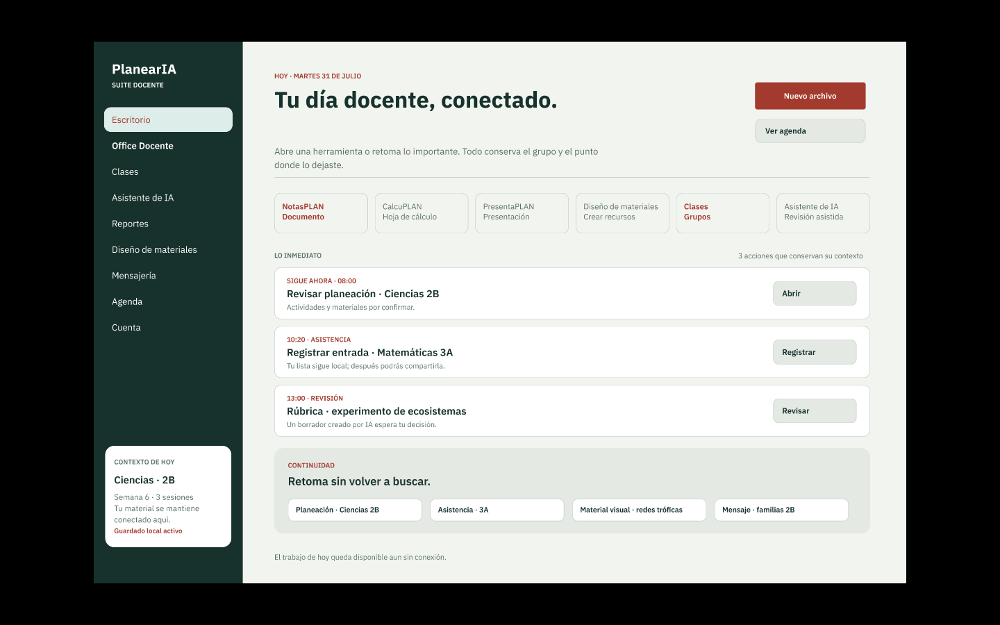
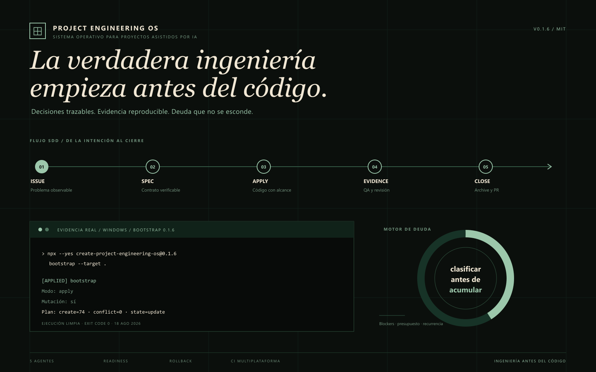

  

Soy desarrollador de software junior y estudiante/egresado de Ingeniería en Tecnologías de la Información y Comunicaciones en el Instituto Tecnológico Superior de Zamora. Trabajo principalmente con **React Native, TypeScript y Node.js**, y me interesa construir productos útiles con una base técnica que pueda mantenerse y comprobarse.

## Proyectos seleccionados

### [PlanearIA](https://github.com/IgnacioBarEsp/PlanearIA)

Plataforma para docentes centrada en reducir su carga de trabajo, evitar trabajo innecesario y mantener todo ordenado. La visión es que los docentes trabajen como ya lo hacen, pero mucho mejor: planeaciones, clases, contenido, comunicación y asistencia con IA dentro de una misma experiencia.

**React Native · Expo · TypeScript · Node.js · MongoDB** 
[Abrir la aplicación web](https://planearai.com) · [Ver el repositorio](https://github.com/IgnacioBarEsp/PlanearIA) · [Descargar APK](https://github.com/IgnacioBarEsp/PlanearIA/releases/latest)

### [Project Engineering OS](https://github.com/IgnacioBarEsp/project-engineering-os)

**Ingeniería de proyectos reproducible desde un solo comando.** CLI publicada en npm para iniciar repositorios con gobernanza, desarrollo guiado por especificaciones, herramientas para agentes y control de deuda técnica. Nació al extraer y generalizar prácticas que adopté mientras construía PlanearIA.

`npx --yes create-project-engineering-os@0.1.6 bootstrap --target .` 
[Ver el repositorio](https://github.com/IgnacioBarEsp/project-engineering-os) · [Ver el paquete en npm](https://www.npmjs.com/package/create-project-engineering-os)

### [Cute Seals](https://github.com/IgnacioBarEsp/Cute_Seals_BP)

  

Add-on para Minecraft Bedrock que incorpora focas domesticables con cuatro variantes por bioma, animaciones, montura anfibia, objetos y comportamientos propios. Fue un proyecto para aprender cómo conviven arte, configuración de entidades y lógica de juego.

**Minecraft Bedrock · JavaScript · Script API · Blockbench** 
[Ver el proyecto](https://github.com/IgnacioBarEsp/Cute_Seals_BP) · [Descargar el add-on](https://github.com/IgnacioBarEsp/Cute_Seals_BP/releases/latest)

### [Salas API](https://github.com/IgnacioBarEsp/salas-api)

<table>
  <tr>
    <td>
      <strong>API REST para administrar espacios de un campus.</strong>  
      Proyecto académico para gestionar salas, mantenimientos, actividades y materiales. Incluye validación de esquema en la base de datos y documentación OpenAPI generada automáticamente.  
      <strong>Python · FastAPI · MongoDB · OpenAPI</strong> 
      <a href="https://github.com/IgnacioBarEsp/salas-api">Ver el repositorio</a>
    </td>
  </tr>
</table>

## Cómo trabajo

En PlanearIA y en mis herramientas personales he adoptado prácticas que me ayudan a trabajar con mayor claridad:

- Uso **desarrollo guiado por especificaciones (SDD)** para definir el cambio y sus criterios de aceptación antes de implementarlo.
- Utilizo herramientas como **GitNexus** para dar a los agentes de IA contexto verificable sobre el código, sus dependencias y el impacto de un cambio.
- Acompaño los cambios con **pruebas automatizadas, revisión visual y CI**, según lo que necesita cada proyecto.
- Trato la IA como una herramienta de ingeniería: propongo, reviso y compruebo su trabajo antes de integrarlo.

## Tecnologías

  
  &nbsp;
  
  &nbsp;
  
  &nbsp;
  
  &nbsp;
  
  &nbsp;
  
  &nbsp;
  

TypeScript · React Native · Expo · Node.js · Python · MongoDB · GitHub Actions

## Sobre mí

Soy un desarrollador junior de Zamora, Michoacán. Me gusta aprender construyendo, documentar las decisiones importantes y entender el producto además del código.

**Contacto:** [IgnacioBar.esp@gmail.com](mailto:IgnacioBar.esp@gmail.com)

<strong>English version</strong>

 

I am a junior software developer and an Information and Communication Technologies Engineering student at Instituto Tecnológico Superior de Zamora. I mainly work with **React Native, TypeScript and Node.js**, and I enjoy building useful products on a technical foundation that can be maintained and verified.

### Selected projects

#### [PlanearIA](https://github.com/IgnacioBarEsp/PlanearIA)

A platform for teachers focused on reducing workload, avoiding unnecessary work and keeping everything organized. Its vision is to let teachers work the way they already do, only much better: lesson planning, classes, content, communication and AI assistance in one connected experience.

**React Native · Expo · TypeScript · Node.js · MongoDB** 
[Open the web app](https://planearai.com) · [View repository](https://github.com/IgnacioBarEsp/PlanearIA) · [Download APK](https://github.com/IgnacioBarEsp/PlanearIA/releases/latest)

#### [Project Engineering OS](https://github.com/IgnacioBarEsp/project-engineering-os)

An npm CLI for starting repositories with governance, spec-driven development, agent tooling and technical-debt control. It grew from practices I adopted while building PlanearIA and later extracted into a reusable project.

`npx --yes create-project-engineering-os@0.1.6 bootstrap --target .` 
[View repository](https://github.com/IgnacioBarEsp/project-engineering-os) · [View on npm](https://www.npmjs.com/package/create-project-engineering-os)

#### [Cute Seals](https://github.com/IgnacioBarEsp/Cute_Seals_BP)

A Minecraft Bedrock add-on with tameable seals, four biome variants, animations, amphibious riding, custom items and behaviors. It helped me learn how art, entity configuration and game logic work together.

**Minecraft Bedrock · JavaScript · Script API · Blockbench** 
[View project](https://github.com/IgnacioBarEsp/Cute_Seals_BP) · [Download add-on](https://github.com/IgnacioBarEsp/Cute_Seals_BP/releases/latest)

#### [Salas API](https://github.com/IgnacioBarEsp/salas-api)

An academic REST API for managing campus rooms, maintenance, activities and materials, with database schema validation and automatically generated OpenAPI documentation.

**Python · FastAPI · MongoDB · OpenAPI** 
[View repository](https://github.com/IgnacioBarEsp/salas-api)

### How I work

- I use **spec-driven development (SDD)** to define changes and acceptance criteria before implementation.
- I use tools such as **GitNexus** to provide AI agents with verifiable context about code, dependencies and change impact.
- I support changes with **automated tests, visual review and CI** according to each project's needs.
- I treat AI as an engineering tool: I propose, review and verify its work before integration.

### About me

I am a junior developer from Zamora, Michoacán, Mexico. I like learning by building, documenting important decisions and understanding the product as well as the code.

**Contact:** [IgnacioBar.esp@gmail.com](mailto:IgnacioBar.esp@gmail.com)

